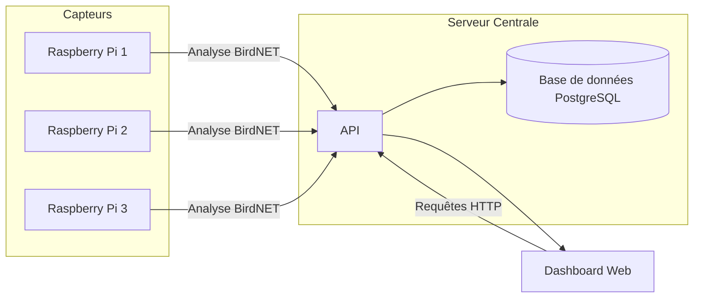
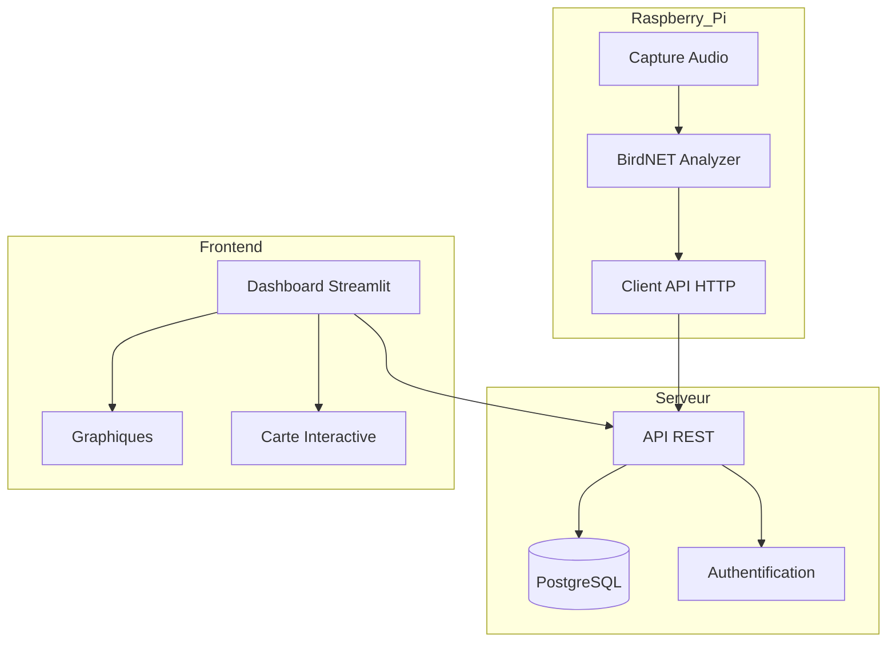
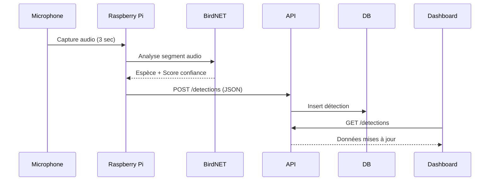

Cahier des charges

# 1. Contexte et définition du problème

→ Mise en place du suivi de trajets d’oiseaux dans un environnement surveillé

# 2. Objectifs du projet

Mettre en place un suivi d’oiseaux sur le campus universitaire Moulin de la Housse à l’aide de plusieurs Raspberry Pi et des sons émis par les différentes espèces.

# 3. Périmètre du projet

→ Se concentrer sur un environnement surveillé, dans notre cas le campus universitaire Moulin de la Housse.

# 4. Description fonctionnelle des besoins

→ 3 Raspberry Pi ou plus.

→ Un serveur centrale avec une API pour collecter les données.

→ Un dashboard pour suivre en temps réel les oiseaux.

→ Utiliser le modèle open-source de BirdNET : <https://github.com/birdnet-team/BirdNET-Analyzer>

# 5. Architecture technique

→ Capteurs audio → Raspberry Pi → API → Base de données → Dashboard Web

**Composants matériels**

* Raspberry Pi 4
* Microphones
* Serveur Linux
* Connexion réseau (Wi-Fi ou Ethernet)

**Composants logiciels**

* BirdNET-Analyzer
* API (Sanic - Python)
* Base de données (PostgreSQL)
* Interface web (React, Streamlit ?)

---
Spécifications techniques

# 1. Contexte et définition du problème

→ Mise en place du suivi de trajets d’oiseaux dans un environnement surveillé

# 2. Architecture technique détaillée

Le système repose sur une architecture distribuée composée de :

1. Nœuds de capture (Raspberry Pi + microphones)
2. Serveur central
3. Base de données
4. API REST
5. Dashboard Web

Flux de données :

# 3. Spécifications Matérielles

* Raspberry Pi
  * Modèle : Raspberry Pi 4 ou 5
  * Stockage : Carte microSD
  * Connectivité : Wi-Fi
* Microphones
  * Type : Microphone USB
  * Sensibilité adaptée à captation extérieure
  * Protection anti-vent
* Boîtier
  * Boîtier étanche IP65 minimum
  * Protection contre pluie, humidité et poussière
  * Fixation sécurisée
* Serveur Central
  * OS : Linux, Ubuntu Server
  * CPU : 4 cœurs
  * RAM : 16 Go
  * Stockage : 500 Go
  * Données redondées sur un disque externe

# 4. Spécifications Logicielles

## 4.1. Système embarqué (Raspberry Pi)

* OS : Raspberry Pi OS
* Python 3.11+
* BirdNET-Analyzer installé localement
* Script Python pour :
  * Capture audio
  * Analyse par BirdNET
  * Envoi vers API
* Docker 29+
* Un conteneur Docker / script Python

## 4.2. Paramètres BirdNET

* Durée des segments audio : 3 secondes
* Seuil de confiance configurable (par défaut : 0.80)
* Région : Europe
* Mode : Analyse en temps réel

## 4.3. API Serveur

→ API REST sécurisée (HTTPS)

→ Framework Sanic

* Endpoints principaux
  * POST /detections
  * GET /detections
    * Filtrage par date
    * Filtrage par espèce
    * Pagination
* GET /statistics
  * Nombre total de détections
  * Répartition par espèce
  * Données journalières

## 4.4. Base de Données

→ SGBD : PostgreSQL

* Tables nécessaires
  * Table sensors
  * Table species
  * Table détections

## 5. Spécifications Réseau

* Communication HTTPS obligatoire
* Authentification par clé API
* Timeout max : 5 secondes
* Mise en cache locale si perte réseau
* Synchronisation différée en cas d’indisponibilité

# 6. Spécifications du Dashboard

## 6.1. Technologies

* Frontend : Streamlit
* Backend : API REST

## 6.2. Fonctionnalités

* Carte interactive des capteurs
* Graphique temporel des détections
* Filtrage dynamique
* Tableau des espèces détectées
* Export CSV

# 7. Processus

→ Diagramme de séquence de détection d’un oiseau :

# 8. Exigences de Performance

* Analyse locale < 3 secondes par segment audio
* Envoi des données < 2 secondes
* Disponibilité système ≥ 95 %
* Gestion de 10 000 détections / jour minimum

# 9. Gestion des Logs

Chaque Raspberry Pi doit enregistrer :

* Démarrage du service
* Erreurs BirdNET
* Échecs d’envoi API
* État réseau

Logs conservés minimum 30 jours.

# 10. Scalabilité

Le système doit permettre :

* L’ajout simple de nouveaux capteurs
* L’augmentation du volume de données
* Le déploiement sur d’autres sites

Architecture conçue pour supporter 50+ capteurs sans modification majeure.

