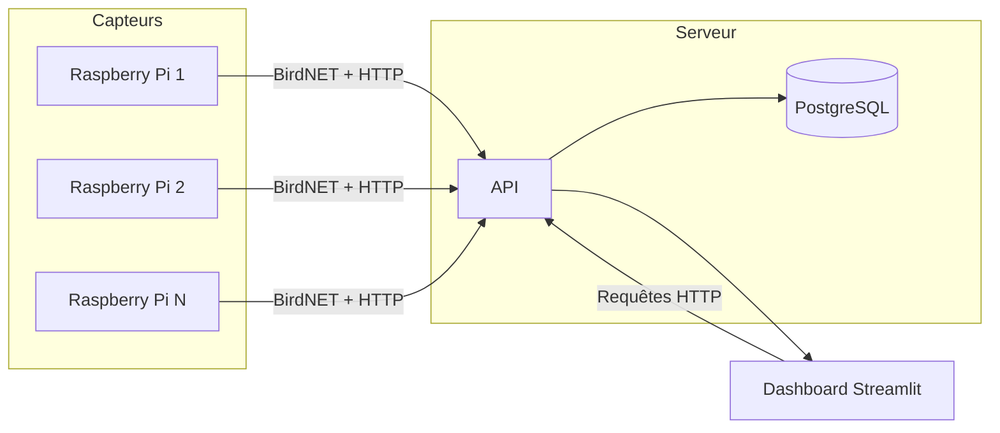

<div align="center">

# URCABirds
URCABirds est un projet de suivi d'oiseaux sur le campus universitaire Moulin de la Housse à l'aide de capteurs audio Raspberry Pi et du modèle open-source BirdNET.

</div>

# 📖 • Sommaire

- [🚀 • Présentation](#--présentation)
- [🛠️ • Technologies](#--technologies)
- [📦 • Installation](#--installation)
- [⚙️ • Variables d'environnement](#--variables-denvironnement)
- [📡 • Endpoints](#--endpoints)
- [📃 • Crédits](#--crédits)
- [📝 • License](#--license)

# 🚀 • Présentation

Ce dépôt contient l'ensemble du projet URCABirds, composé de trois modules :

- **Worker** - script embarqué sur chaque Raspberry Pi qui capture l'audio, analyse les sons avec BirdNET et envoie les détections à l'API.
- **API** - serveur REST qui reçoit, stocke et expose les données de détection.
- **Dashboard** - interface web Streamlit pour visualiser les détections en temps réel.

Fonctionnalités principales :
- Capture audio en continu depuis un microphone USB
- Analyse locale par [BirdNET-Analyzer](https://github.com/birdnet-team/BirdNET-Analyzer) avec seuil de confiance configurable
- Envoi automatique des détections vers l'API (authentification par clé API)
- Auto-enregistrement du capteur au démarrage (position GPS, nom)
- API REST avec documentation OpenAPI interactive (Scalar UI)
- Dashboard interactif : carte des capteurs, graphiques temporels, tableau des espèces
- Rate limiting par IP avec buckets configurables
- Traductions EN/FR des noms scientifiques BirdNET

Flux de données :



# 🛠️ • Technologies

### API

| Composant | Technologie |
|---|---|
| Framework web | [Sanic](https://sanic.dev/) `>=25.12` |
| Base de données | [PostgreSQL](https://www.postgresql.org/) via [asyncpg](https://github.com/MagicStack/asyncpg) `>=0.31` |
| Client HTTP | [aiohttp](https://docs.aiohttp.org/) `>=3.13` |
| Documentation API | [sanic-ext](https://github.com/PaulBayfield/sanic-ext) (fork) + [Scalar](https://scalar.com/) |
| Gestionnaire de paquets | [uv](https://github.com/astral-sh/uv) |
| Conteneurisation | [Docker](https://www.docker.com/) + [Docker Compose](https://docs.docker.com/compose/) |

### Worker

| Composant | Technologie |
|---|---|
| Analyse acoustique | [BirdNET](https://github.com/birdnet-team/BirdNET-Analyzer) `>=0.2.5` |
| Capture audio | [sounddevice](https://python-sounddevice.readthedocs.io/) `>=0.5.5` |
| Lecture/écriture audio | [soundfile](https://python-soundfile.readthedocs.io/) `>=0.13.1` |
| Client HTTP | [aiohttp](https://docs.aiohttp.org/) `>=3.13` |
| Gestionnaire de paquets | [uv](https://github.com/astral-sh/uv) |
| Conteneurisation | [Docker](https://www.docker.com/) + [Docker Compose](https://docs.docker.com/compose/) |

### Dashboard

| Composant | Technologie |
|---|---|
| Framework web | [Streamlit](https://streamlit.io/) `>=1.58` |
| Graphiques | [Plotly](https://plotly.com/python/) `>=6.6` |
| Traitement de données | [pandas](https://pandas.pydata.org/) `>=2.3` |
| Analyse audio | [librosa](https://librosa.org/) `>=0.11` |
| Client HTTP | [requests](https://docs.python-requests.org/) `>=2.32` |

# 📦 • Installation

### Worker - avec Docker (recommandé pour Raspberry Pi)

Vous aurez besoin de [Docker](https://www.docker.com/) et de [Docker Compose](https://docs.docker.com/compose/) installés sur votre Raspberry Pi.

```bash
curl -O https://raw.githubusercontent.com/PaulBayfield/URCABirds/main/src/worker/compose.yml
```

Créez un fichier `.env` dans le même répertoire (voir [Variables d'environnement - Worker](#worker-1)), puis lancez :

```bash
docker compose up -d
```

---

### API - avec Docker (recommandé)

```bash
git clone https://github.com/PaulBayfield/URCABirds
cd URCABirds
```

Créez un fichier `.env` à la racine du projet (voir [Variables d'environnement - API](#api-1)), puis lancez :

```bash
docker compose up -d
```

L'API sera disponible sur `http://localhost:7000`.

---

### En local (développement)

Vous aurez besoin de [Python 3.13+](https://www.python.org/) et de [uv](https://github.com/astral-sh/uv).

```bash
git clone https://github.com/PaulBayfield/URCABirds
cd URCABirds
uv sync
```

Démarrez l'API :

```bash
uv run src/api/__main__.py
```

Démarrez le dashboard :

```bash
uv run streamlit run src/dashboard/main.py
```

# ⚙️ • Variables d'environnement

### API

Créez un fichier `.env` dans `src/api/` en vous basant sur `.env.example` :

```env
# PostgreSQL
POSTGRES_DATABASE=URCABirds
POSTGRES_USER=
POSTGRES_PASSWORD=
POSTGRES_HOST=localhost
POSTGRES_PORT=5432

# API
API_DOMAIN=http://localhost:7000
API_PORT=7000
API_DEBUG=False
```

| Variable | Description | Valeur par défaut |
|---|---|---|
| `POSTGRES_DATABASE` | Nom de la base de données | `URCABirds` |
| `POSTGRES_USER` | Utilisateur PostgreSQL | - |
| `POSTGRES_PASSWORD` | Mot de passe PostgreSQL | - |
| `POSTGRES_HOST` | Hôte PostgreSQL | `localhost` |
| `POSTGRES_PORT` | Port PostgreSQL | `5432` |
| `API_DOMAIN` | URL publique de l'API (utilisée dans la doc OpenAPI) | `http://localhost:7000` |
| `API_PORT` | Port d'écoute du serveur | `7000` |
| `API_DEBUG` | Active le mode debug Sanic | `False` |

### Worker

Créez un fichier `.env` dans le répertoire du worker en vous basant sur `src/worker/.env.example` :

```env
API_URL=https://urcabirds.bayfield.dev/v1
API_KEY=
SENSOR_ID=sensor-001
SENSOR_NAME=Raspi Campus          # Optionnel (défaut : SENSOR_ID)
CONFIDENCE_THRESHOLD=0.5
LATITUDE=49.2429809
LONGITUDE=4.0590846
LOG_LEVEL=INFO                    # DEBUG, INFO, WARNING, ERROR
```

| Variable | Description | Valeur par défaut |
|---|---|---|
| `API_URL` | URL de base de l'API (sans slash final) | - |
| `API_KEY` | Clé API pour l'authentification | - |
| `SENSOR_ID` | Identifiant unique du capteur | - |
| `SENSOR_NAME` | Nom lisible du capteur | `SENSOR_ID` |
| `CONFIDENCE_THRESHOLD` | Seuil de confiance BirdNET (0.0 – 1.0) | - |
| `LATITUDE` | Latitude GPS du capteur | - |
| `LONGITUDE` | Longitude GPS du capteur | - |
| `LOG_LEVEL` | Niveau de log | `INFO` |

### Dashboard

Créez un fichier `.env` dans `src/dashboard/` en vous basant sur `src/dashboard/.env.example` :

```env
API_URL=https://urcabirds.bayfield.dev
```

| Variable | Description |
|---|---|
| `API_URL` | URL publique de l'API (sans `/v1`) |

# 📡 • Endpoints

La documentation interactive complète est disponible à la racine de l'API (ex : `http://localhost:7000`).

| Méthode | Endpoint | Description |
|---|---|---|
| `GET` | `/v1/status` | Statut de l'API |
| `GET` | `/v1/stats` | Statistiques globales (détections, capteurs, espèces) |
| `GET` | `/v1/detections` | Liste paginée des détections (filtres : `species`, `sensor_id`, `limit`, `offset`) |
| `POST` | `/v1/detections` | Soumettre une détection (authentification requise) |
| `GET` | `/v1/detections/{id}` | Détails d'une détection |
| `GET` | `/v1/sensors` | Liste de tous les capteurs enregistrés |
| `POST` | `/v1/sensors/register` | Enregistrer ou mettre à jour un capteur (authentification requise) |
| `GET` | `/v1/sensors/{sensor_id}` | Détails et statistiques d'un capteur |
| `GET` | `/v1/species` | Liste de toutes les espèces observées |
| `GET` | `/v1/species/{name}` | Statistiques d'une espèce (nom scientifique) |
| `GET` | `/v1/translations` | Table de traductions EN/FR des noms BirdNET (recherche, pagination) |
| `GET` | `/v1/translations/{scientific_name}` | Traduction EN/FR d'une espèce |
| `GET` | `/v1/apikeys` | Liste des clés API (admin uniquement) |
| `POST` | `/v1/apikeys` | Créer une clé API (admin uniquement) |
| `DELETE` | `/v1/apikeys/{id}` | Supprimer une clé API (admin uniquement) |

# 📃 • Crédits

- [Paul Bayfield](https://github.com/PaulBayfield)
- [Lucas Charmettan](https://github.com/LucasCrmt)
- [BirdNET Team](https://github.com/birdnet-team/BirdNET-Analyzer)

# 📝 • License

URCABirds est sous licence [Apache 2.0](LICENSE).

```
Copyright 2026 Paul BAYFIELD & Lucas CHARMETTAN

Licensed under the Apache License, Version 2.0 (the "License");
you may not use this file except in compliance with the License.
You may obtain a copy of the License at

   http://www.apache.org/licenses/LICENSE-2.0

Unless required by applicable law or agreed to in writing, software
distributed under the License is distributed on an "AS IS" BASIS,
WITHOUT WARRANTIES OR CONDITIONS OF ANY KIND, either express or implied.
See the License for the specific language governing permissions and
limitations under the License.
```
