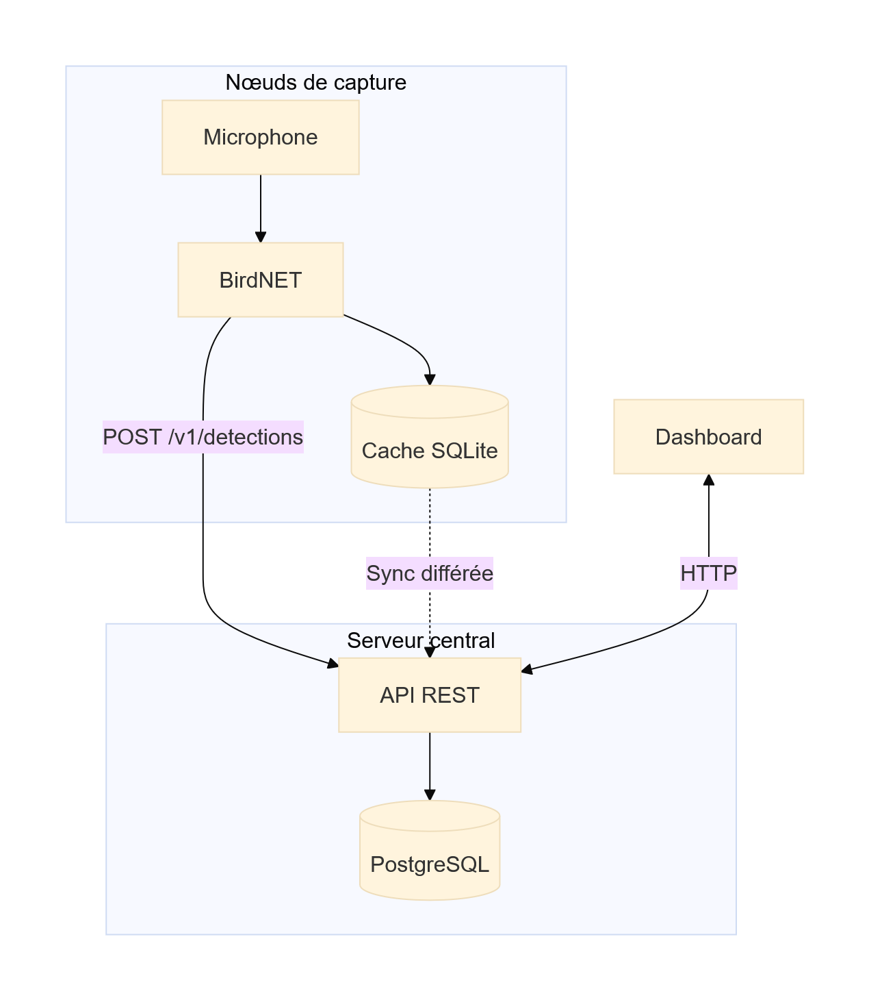
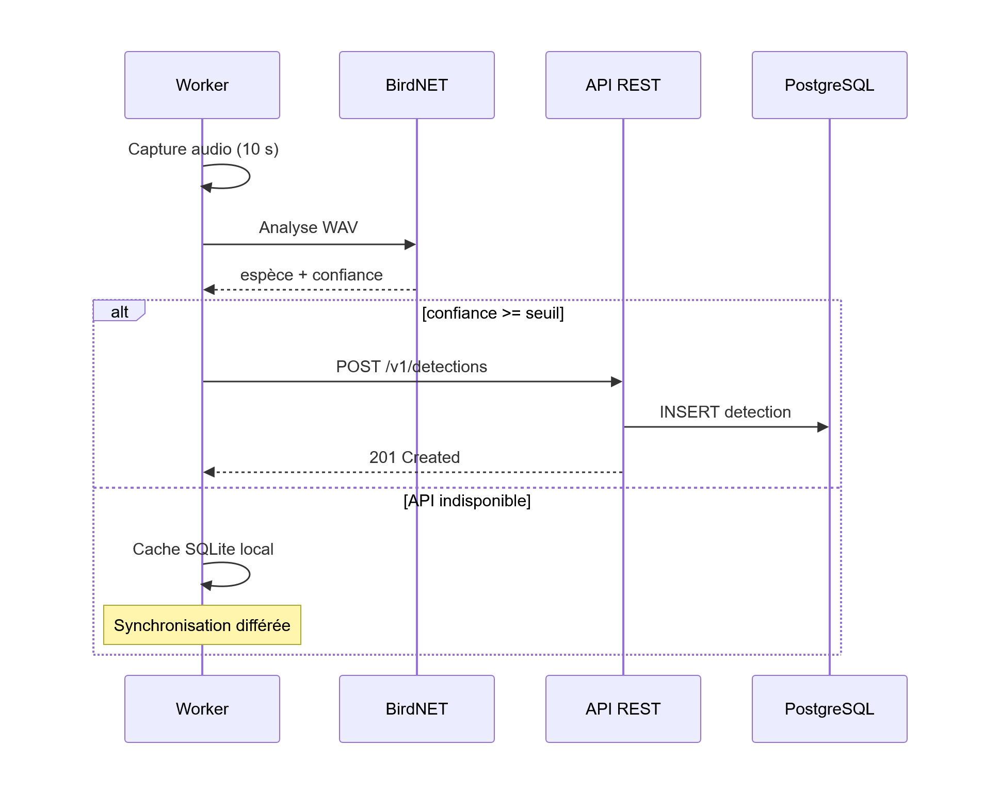
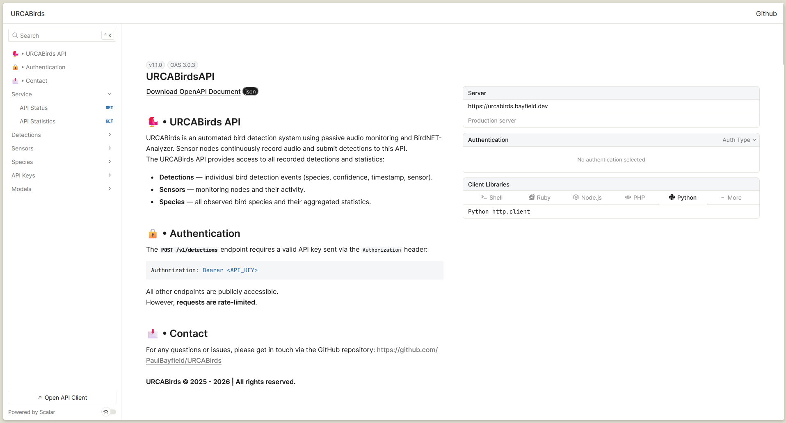
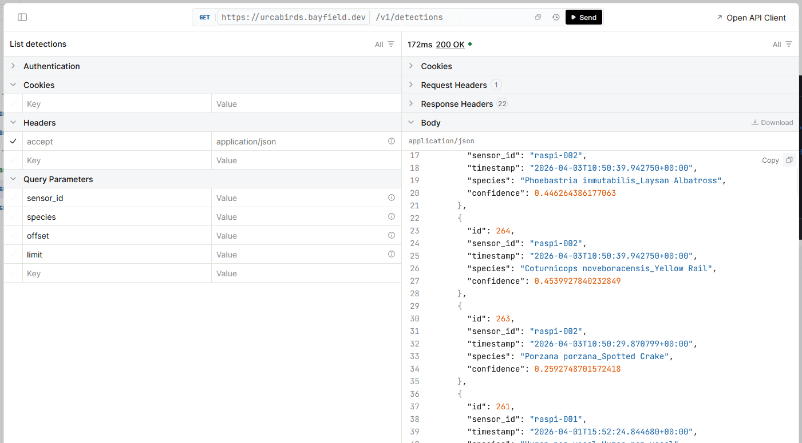
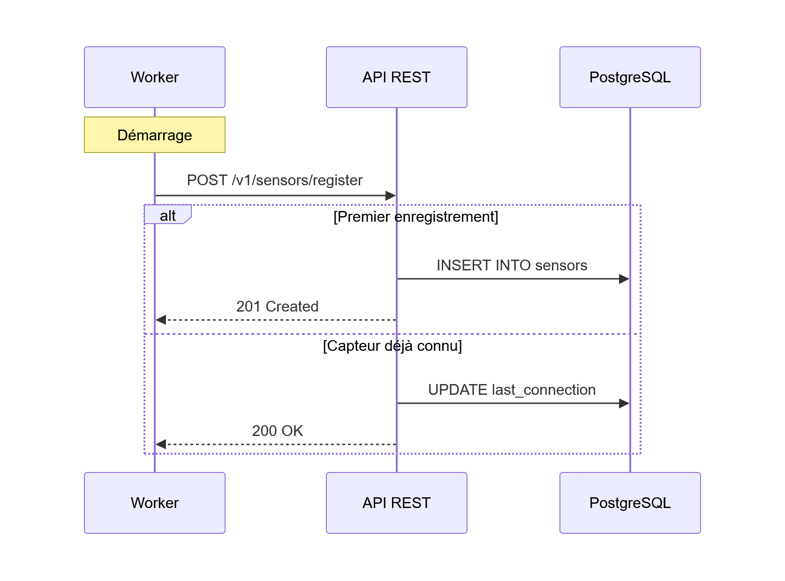
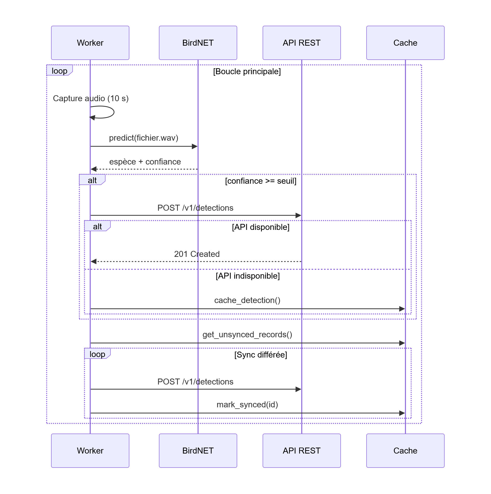

# Table des sigles et abréviations {#table-sigles}

- **AMOA** : Assistance à la Maîtrise d'Ouvrage
- **API** : Application Programming Interface
- **CI/CD** : Continuous Integration / Continuous Deployment
- **HTTP** : HyperText Transfer Protocol
- **HTTPS** : HyperText Transfer Protocol Secure
- **IA** : Intelligence Artificielle
- **IoT** : Internet of Things
- **JSON** : JavaScript Object Notation
- **KPI** : Key Performance Indicator (indicateur clé de performance)
- **MOA** : Maîtrise d'Ouvrage
- **MOE** : Maîtrise d'Œuvre
- **PDCA** : Plan, Do, Check, Act
- **RACI** : Responsible, Accountable, Consulted, Informed
- **REST** : Representational State Transfer
- **SMART** : Spécifique, Mesurable, Acceptable, Réaliste, Temporellement défini
- **SQL** : Structured Query Language
- **URCA** : Université de Reims Champagne-Ardenne
- **WAV** : Waveform Audio File Format

# Introduction {#introduction}

Dans le contexte de la surveillance de la biodiversité, l'identification automatique des espèces aviaires par analyse acoustique ouvre de nouvelles perspectives pour le suivi des populations d'oiseaux en milieu naturel ou péri-urbain. Ce projet, développé dans le cadre du module INFO0806 à l'URCA, vise à déployer un système de suivi automatisé des oiseaux sur le campus universitaire Moulin de la Housse à Reims.

Le système repose sur un réseau de nœuds de capture basés sur des Raspberry Pi équipés de microphones. Chaque nœud capture en continu des segments audio de l'environnement et les analyse localement à l'aide du modèle de reconnaissance ornithologique BirdNET [@kahl2021birdnet]. Les détections identifiées sont ensuite transmises à un serveur central via une API REST, persistées dans une base de données relationnelle PostgreSQL, et consultables via un tableau de bord web.

Ce rapport présente l'architecture générale du système, les choix techniques retenus, ainsi que les détails d'implémentation des deux composants déjà développés : le service de capture (*worker*) embarqué sur Raspberry Pi, l'API REST centrale ainsi que le tableau de bord de visualisation. Les sections suivantes détaillent les différentes étapes du projet, les défis rencontrés et les solutions apportées pour garantir la robustesse, la performance et la scalabilité du système.

# Gestion de projet {#gestion-projet}

## Acteurs du projet

Le projet mobilise deux catégories d'acteurs, conformément au cadre défini en gestion de projets.

La Maîtrise d'Ouvrage (MOA) est représentée par l'encadrant du module INFO0806 de l'URCA, Monsieur Fouchal HACENE. Il exprime le besoin, définit les exigences fonctionnelles et valide les livrables tout au long du projet.

La Maîtrise d'Œuvre (MOE) est constituée de l'équipe de développement, Paul Bayfield et Lucas Charmettan, qui assure la conception, le développement et le déploiement de l'intégralité du système.

## Triangle des contraintes

Le projet a été piloté en tenant compte des trois contraintes interdépendantes du triangle d'or :

- **Performance** : livrer un système fonctionnel capable d'identifier des espèces aviaires avec un seuil de confiance ≥ 0,80, de transmettre les détections en temps réel et d'assurer la résilience hors-ligne du pipeline.
- **Délais** : respecter les jalons imposés par le module. Le rendu du rapport le 1^er^ juin 2026, fourniture du lien GitHub le 8 juin 2026, soutenance orale le 11 juin 2026.
- **Coûts** : minimiser les dépenses en s'appuyant exclusivement sur des technologies open source et des services gratuits (Docker Hub, GitHub Actions), avec un matériel mis à disposition par l'UFR.

L'indisponibilité des puces 4G/5G a constitué une contrainte externe imprévue. Conformément à la logique du triangle, cette situation a nécessité un ajustement de la performance (substitution des données réelles par des données simulées) afin de préserver les délais de livraison.

## Objectifs SMART

Les objectifs du projet ont été formulés selon la méthode SMART :

| Critère | Application au projet |
|---------|----------------------|
| **Spécifique** | Déployer un réseau de capteurs acoustiques pour identifier automatiquement les oiseaux sur le campus Moulin de la Housse |
| **Mesurable** | Seuil BirdNET ≥ 0,80 ; disponibilité ≥ 95 % ; capacité ≥ 10 000 détections/jour ; support de 50+ capteurs simultanés |
| **Acceptable** | Objectifs validés conjointement par les encadrants (MOA) et l'équipe de développement (MOE) en début de projet |
| **Réaliste** | Technologies maîtrisées (Python, Docker, API REST), matériel accessible (Raspberry Pi 4/5) |
| **Temporel** | Rapport au 1^er^ juin, lien GitHub au 8 juin, soutenance au 11 juin 2026 |

## Répartition des responsabilités

La matrice RACI ci-dessous formalise la répartition des responsabilités entre les acteurs du projet :

| Tâche | Paul Bayfield | Lucas Charmettan | Encadrants (MOA) |
|-------|:---:|:---:|:---:|
| Architecture système | A/R | A/R | I |
| Développement worker | A/R | A/R | I |
| Développement API REST | A/R | C | I |
| Pipeline CI/CD | A/R | C | I |
| Tableau de bord | C | A/R | I |
| Rédaction du rapport | R | R | A |
| Validation des livrables | I | I | A |

*R = Réalise • A = Approuve • C = Consulté • I = Informé*

## Méthodologie

Le projet a été conduit en suivant une organisation agile inspirée de Scrum, adaptée à notre échelle. Nous avons travaillé par sprints de deux à trois semaines, chacun structuré autour d'un planning (définition des tâches et répartition du travail) et d'une review (bilan des livrables et ajustements pour la suite). Des points hebdomadaires informels assuraient la synchronisation continue entre les membres de l'équipe.

Cette démarche itérative s'inscrit dans les trois grandes phases du cycle de vie d'un projet : le cadrage (analyse des besoins et planification, sprints 1-2), la conduite (développement et industrialisation, sprints 3-4) et la clôture (finalisation et soutenance, sprint 5). À chaque fin de sprint, une boucle PDCA (Plan-Do-Check-Act) a guidé l'amélioration continue : les points de blocage identifiés en review alimentaient directement la planification du sprint suivant.

## Sprints

### Sprint 1 : Initialisation et service Worker (18 févr. - 3 mars 2026)

**Planning**

L'idée de départ était simple : il fallait d'abord savoir où on allait. Ce premier sprint a donc servi à poser l'architecture globale du système, choisir les technologies et écrire une première version fonctionnelle du worker.

- Initialisation du dépôt GitHub et de la structure du projet
- Conception de l'architecture en trois niveaux (capteurs, API, visualisation)
- Choix des technologies : Python avec asyncio pour le worker, BirdNET pour l'analyse, PostgreSQL pour la persistance
- Développement du pipeline de base : capture audio, analyse BirdNET, boucle asynchrone
\   
   
   
\   
   
   

**Review**

Le pipeline fonctionne de bout en bout en local. Le worker capture des segments audio, les soumet à BirdNET et journalise les détections identifiées. L'architecture générale a été validée et la configuration via `.env` est en place.

### Sprint 2 : API REST et CI/CD (4 mars - 13 mars 2026)

**Planning**

Avec le worker opérationnel, il fallait développer l'API REST côté serveur, conteneuriser les deux services et automatiser les déploiements.

- Développement des routes, modèles et composants de l'API avec Sanic
- Mise en place de l'authentification Bearer et de la limitation du débit
- Création des Dockerfiles pour l'API et le worker
- Configuration des workflows GitHub Actions pour la publication des images Docker
- Mise en place de Dependabot pour maintenir les dépendances à jour
\   
   
   
\   
   
   

**Review**

L'API expose l'ensemble des endpoints prévus. L'authentification et le rate limiting sont fonctionnels. Le pipeline CI/CD publie automatiquement les images sur Docker Hub à chaque push sur `main`. L'auto-enregistrement du capteur via `POST /v1/sensors/register` fonctionne correctement.

### Sprint 3 : Stabilisation et support Raspberry Pi (13 mars - 1er avril 2026)

**Planning**

Les premiers tests sur Raspberry Pi réel ont mis en évidence des problèmes de compatibilité matérielle. Ce sprint était centré sur la résolution de ces blocages.

- Migration de l'image worker vers `python:3.13-slim` pour pouvoir installer `portaudio19-dev`
- Ajout du support ARM64 via `docker buildx` dans le pipeline CI/CD
- Correction du canal audio en mono, requis par BirdNET
- Ajustement du niveau de journalisation
\   
   
   
\   
   
   

**Review**

Les images sont désormais publiées pour `amd64` et `arm64`, ce qui permet de déployer directement depuis Docker Hub sur les Raspberry Pi 4 et 5 sans recompilation locale. La capture audio fonctionne correctement sur le matériel cible. Le service a été validé en conditions réelles sur le campus.

### Sprint 4 : Maintenance et rédaction du rapport (avril - mai 2026)

**Planning**

Le gros du développement étant terminé, ce sprint s'est concentré sur la stabilité du projet dans le temps et le démarrage de la rédaction du rapport.

- Mise à jour des dépendances Python et des actions GitHub Actions
- Rédaction du rapport : architecture, implémentation, déploiement
- Préparation des figures et diagrammes de séquence
\   
   
   
\   
   
   

**Review**

Le rapport est structuré et les sections principales sont rédigées. Les diagrammes sont intégrés.

### Sprint 5 : Tableau de bord et finalisation (mai - 1er juin 2026, en cours)

**Planning**

Ce dernier sprint couvre le développement du tableau de bord de visualisation, la finalisation du rapport et la préparation de l'oral.

- Développement du tableau de bord web pour visualiser les détections
- Affichage des détections sur une carte interactive du campus
- Rendu du rapport (délai : 1er juin 2026 à 12 h)
- Fourniture du lien GitHub (délai : 8 juin 2026 à 12 h)
- Préparation de la soutenance orale (11 juin 2026)

# 1. Contexte et objectifs {#contexte}

## 1.1. Problématique

Le suivi des populations d'oiseaux représente un enjeu écologique important pour évaluer la biodiversité et mesurer l'impact des activités humaines sur les écosystèmes. Les méthodes traditionnelles de recensement requièrent une présence humaine régulière sur le terrain, ce qui est coûteux en temps et limite la granularité des données collectées.

L'avancée des modèles d'IA appliqués à la bioacoustique permet désormais d'identifier automatiquement les espèces aviaires à partir de leurs chants. Le modèle BirdNET [@birdnet_analyzer], développé par la Cornell Lab of Ornithology et l'Institut Max Planck, est en mesure de distinguer plus de 6 000 espèces d'oiseaux avec une précision élevée, en s'appuyant sur des enregistrements audio de courte durée.

## 1.2. Objectifs du projet

Le projet URCABirds vise à :

- déployer un réseau de capteurs autonomes sur le campus universitaire Moulin de la Housse ;
- identifier automatiquement les espèces aviaires en temps réel par analyse acoustique ;
- centraliser les données de détection sur un serveur avec une API REST ;
- offrir un tableau de bord de visualisation permettant le suivi temporel et géographique des détections.
\  
  

\  
  


## 1.3. Périmètre

Le périmètre initial du projet se limite au campus universitaire Moulin de la Housse, avec au minimum trois nœuds de capture distribués. L'architecture a néanmoins été conçue pour être généralisable à d'autres sites avec un minimum de reconfiguration.

À ce jour, les Raspberry Pi ne sont pas encore déployés en production sur le campus. Deux obstacles liés à la connectivité l'en empêchent : le Wi-Fi de l'université n'est pas disponible partout sur le campus, et surtout il impose une ré-authentification manuelle quotidienne sur le portail captif, incompatible avec des capteurs autonomes. En attendant la livraison de puces 4G/5G qui permettront une connexion indépendante du réseau universitaire, les capteurs ne peuvent pas transmettre leurs données au serveur central.

Pour permettre le développement et les tests du tableau de bord en l'absence de données réelles, nous avons intégré des données simulées, inspirées des positions géographiques effectives des futurs emplacements de capteurs sur le campus.

# 2. Architecture du système {#architecture}

## 2.1. Vue d'ensemble

Le système repose sur une architecture distribuée à trois niveaux : les nœuds de capture (Raspberry Pi avec microphones USB), le serveur central (API REST et base de données PostgreSQL), et l'interface web de visualisation (en cours de développement).

{#fig-arch}

## 2.2. Composants matériels

Chaque nœud de capture est composé d'un Raspberry Pi 4 ou 5, d'une carte microSD, d'un microphone USB adapté à la captation extérieure et d'un boîtier étanche. La connectivité est assurée par Wi-Fi ou Ethernet selon l'emplacement.

Le serveur central tourne sous Linux Ubuntu Server sur une machine disposant de 4 cœurs, 16 Go de RAM et 1 To de stockage, avec redondance sur disque externe.

## 2.3. Flux de données

Le cycle de vie d'une détection suit les étapes suivantes :

{#fig-seq-flux}

# 3. Nœuds de capture (Worker) {#worker}

## 3.1. Architecture générale

Le service *worker* est un programme Python asynchrone (`asyncio`) déployé en conteneur Docker sur chaque Raspberry Pi. Il orchestre l'ensemble du cycle : capture audio, analyse ornithologique, transmission à l'API et gestion du cache hors-ligne.

La classe `Worker` est le point d'entrée principal. Elle initialise les différents sous-systèmes au démarrage et exécute une boucle principale infinie :

1. Enregistrement d'un segment audio de 10 secondes dans le répertoire `captures/`
2. Lancement de l'analyse BirdNET dans un *thread pool executor* (tâche CPU-intensive)
3. Transmission des détections filtrées à l'API REST
4. Synchronisation périodique des enregistrements mis en cache localement

L'utilisation de `concurrent.futures.ThreadPoolExecutor` permet d'éviter le blocage de la boucle `asyncio` lors de l'inférence BirdNET, qui est une opération synchrone et intensivement calculatoire. Le nombre de *threads* alloués est `max(1, nb_cœurs - 1)`.

## 3.2. Capture audio

La classe `Audio` (module `utils/audio.py`) gère l'enregistrement via `sounddevice` [@sounddevice] et la sauvegarde sur disque avec `soundfile`. L'audio est enregistré en mono à 44 100 Hz au format PCM 16 bits, par segments de 10 secondes configurables.

En cas d'indisponibilité du périphérique audio (environnement de test), le module bascule automatiquement sur un mode *mock* simulant la durée d'enregistrement sans capturer de vrai signal, permettant de tester le reste du pipeline.

## 3.3. Analyse ornithologique avec BirdNET

La classe `Analyser` (module `utils/analyser.py`) encapsule le modèle BirdNET v2.4 [@birdnet_analyzer] via la bibliothèque Python `birdnet`. Le modèle acoustique est chargé une seule fois à l'initialisation du worker.

```python
self.model = birdnet.load("acoustic", "2.4", "tf")
```
\  
  
  

Pour chaque segment audio, la méthode `analyse_audio()` appelle `model.predict()` sur le fichier WAV, itère sur les prédictions retournées sous forme de tableau structuré, filtre les résultats selon le seuil de confiance configurable (`CONFIDENCE_THRESHOLD`), puis supprime le fichier audio temporaire. Le seuil par défaut de 0,80 est recommandé pour limiter les faux positifs en conditions extérieures.
\  
  
   
\  
  
  

## 3.4. Cache local et résilience hors-ligne

La classe `Database` (module `utils/db.py`) gère un cache SQLite local dans `cache.db`. Ce mécanisme garantit qu'aucune détection n'est perdue en cas d'indisponibilité réseau ou de l'API.

La table SQLite `detections` stocke les champs `timestamp`, `species`, `confidence` et un indicateur booléen `synced`. Lors de chaque cycle de la boucle principale, `sync_offline_data()` récupère les entrées non synchronisées et tente de les transmettre à l'API. Dès qu'une tentative échoue, la synchronisation s'arrête pour éviter d'inonder l'API à la reprise réseau.

## 3.5. Configuration

Au démarrage, le worker s'auto-enregistre auprès de l'API via `POST /v1/sensors/register`, en transmettant son identifiant, ses coordonnées GPS et son nom. Si le capteur est déjà enregistré, l'appel met à jour le champ `last_connection`. L'ensemble du comportement est piloté par des variables d'environnement définies dans un fichier `.env` : `API_URL`, `API_KEY`, `SENSOR_ID`, `SENSOR_NAME`, `CONFIDENCE_THRESHOLD`, `LATITUDE`, `LONGITUDE`, `AUDIO_DURATION` et `LOG_LEVEL`.

# 4. API REST {#api}

## 4.1. Présentation

L'API REST est développée avec le framework Sanic [@sanic] (Python 3.13+), un framework web asynchrone adapté aux charges I/O intensives. Elle expose les données de détection aux workers et au futur tableau de bord, et assure la gestion du registre de capteurs ainsi que l'administration des clés d'accès. La documentation OpenAPI est générée automatiquement et accessible via Scalar UI. La connexion à PostgreSQL est gérée par `asyncpg` [@asyncpg] avec un pool de 10 connexions maintenues en permanence.

{#fig-scalar}

## 4.2. Endpoints disponibles

Tous les endpoints sont versionnés sous le préfixe `/v1/`. L'endpoint `GET /v1/detections` accepte les paramètres `limit` (1 à 100, défaut 50), `offset`, `species` et `sensor_id` pour filtrer et paginer les résultats. L'endpoint `POST /v1/sensors/register` effectue un *upsert* : si le capteur existe déjà, ses métadonnées et sa date de dernière connexion sont mises à jour, sinon un nouvel enregistrement est créé.

| Méthode | Endpoint | Auth | Description |
|---------|----------|------|-------------|
| `POST` | `/v1/detections` | Requise | Soumettre une détection |
| `GET` | `/v1/detections` | Optionnelle | Lister les détections (paginé, filtrable) |
| `GET` | `/v1/detections/{id}` | Optionnelle | Consulter une détection par ID |
| `POST` | `/v1/sensors/register` | Requise | Enregistrer ou mettre à jour un capteur |
| `GET` | `/v1/sensors` | Optionnelle | Lister tous les capteurs |
| `GET` | `/v1/sensors/{sensor_id}` | Optionnelle | Consulter un capteur |
| `GET` | `/v1/species` | Optionnelle | Lister les espèces détectées |
| `GET` | `/v1/species/{name}` | Optionnelle | Statistiques d'une espèce |
| `GET` | `/v1/status` | Aucune | Health check |
| `GET` | `/v1/stats` | Aucune | Statistiques globales |
| `GET` | `/v1/apikeys` | Admin | Lister les clés d'API |
| `POST` | `/v1/apikeys` | Admin | Créer une clé d'API |
| `DELETE` | `/v1/apikeys/{id}` | Admin | Supprimer une clé d'API |

{#fig-api}

## 4.3. Authentification

L'API utilise une authentification par clé Bearer (`Authorization: Bearer <API_KEY>`). Les clés sont stockées dans la table `api_keys` de PostgreSQL et peuvent être marquées comme *admin* pour accéder aux endpoints de gestion.

Pour réduire les accès en base de données, les tokens validés sont mis en cache en mémoire pendant 60 secondes via le dictionnaire `_TOKEN_CACHE`. Deux décorateurs distincts protègent les routes : `@require_api_key` vérifie la présence d'une clé valide, et `@require_admin_key` exige en plus le flag `admin = TRUE`.

## 4.4. Limitation du débit

Le décorateur `@ratelimit()` protège chaque endpoint contre les abus. Par défaut, la limite est fixée à 100 requêtes par fenêtre de 60 secondes, par IP ou par clé d'API. En cas de dépassement, l'API retourne une réponse `429 Too Many Requests` avec un en-tête `Retry-After` indiquant le délai d'attente. Le comptage est réalisé par *buckets* en mémoire, configurables par endpoint.

# 5. Base de données {#bdd}

## 5.1. Schéma

La base de données PostgreSQL repose sur trois tables. La table **`api_keys`** gère les clés d'authentification. Chaque clé possède un flag `admin` permettant de distinguer les accès privilégiés. La table **`sensors`** constitue le registre des capteurs déployés, avec leurs coordonnées géographiques et une référence vers leur clé d'API associée. Les champs `first_registered` et `last_connection` permettent de suivre l'activité de chaque nœud. La table **`detections`** stocke chaque détection ornithologique. La colonne `sensor_id` est une clé étrangère vers `sensors(id)` avec suppression en cascade pour garantir la cohérence référentielle.

```sql
CREATE TABLE api_keys (
    id         SERIAL PRIMARY KEY,
    key        TEXT NOT NULL UNIQUE,
    name       TEXT NOT NULL,
    admin      BOOLEAN NOT NULL DEFAULT FALSE,
    created_at TIMESTAMPTZ DEFAULT NOW()
);

CREATE TABLE sensors (
    id               SERIAL PRIMARY KEY,
    sensor_id        TEXT NOT NULL UNIQUE,
    name             TEXT NOT NULL,
    latitude         DOUBLE PRECISION NOT NULL,
    longitude        DOUBLE PRECISION NOT NULL,
    description      TEXT,
    api_key_id       INTEGER NOT NULL REFERENCES api_keys(id) ON DELETE CASCADE,
    first_registered TIMESTAMPTZ DEFAULT NOW(),
    last_connection  TIMESTAMPTZ DEFAULT NOW()
);

CREATE TABLE detections (
    id         SERIAL PRIMARY KEY,
    sensor_id  INTEGER NOT NULL REFERENCES sensors(id) ON DELETE CASCADE,
    timestamp  TEXT NOT NULL,
    species    TEXT NOT NULL,
    confidence REAL NOT NULL
);
```

Les insertions et requêtes complexes (filtrage, pagination, agrégation) sont réalisées via des requêtes SQL paramétrées avec `asyncpg`, sans ORM, pour des performances optimales.

# 6. Déploiement {#deploiement}

## 6.1. Conteneurisation Docker

L'API et le worker sont chacun packagés sous forme d'image Docker [@docker] indépendante. L'image de l'API utilise `python:3.13-alpine` pour sa légèreté et expose le port `7000`. L'image du worker utilise `python:3.13-slim`, nécessaire pour compiler la dépendance système `portaudio19-dev` requise par `sounddevice`.

Les images sont construites et publiées automatiquement par le pipeline CI/CD sur Docker Hub. Le worker dispose d'un fichier `compose.yml` facilitant son déploiement sur le Raspberry Pi :

```yaml
services:
  worker:
    image: paulbayfield/urcabirds-worker:latest
    container_name: worker
    platform: linux/arm64
    devices:
      - "/dev/snd:/dev/snd"
    group_add:
      - audio
    ipc: host
    environment:
      - API_URL=${API_URL}
      - API_KEY=${API_KEY}
      - SENSOR_ID=${SENSOR_ID}
      - SENSOR_NAME=${SENSOR_NAME}
      - CONFIDENCE_THRESHOLD=${CONFIDENCE_THRESHOLD}
      - LATITUDE=${LATITUDE}
      - LONGITUDE=${LONGITUDE}
      - LOG_LEVEL=${LOG_LEVEL}
    restart: unless-stopped
```
\  
  
   

Plusieurs points méritent d'être soulignés :

- **`image`** : le worker est déployé depuis l'image publiée sur Docker Hub, sans nécessiter de compilation locale sur le Raspberry Pi.
- **`platform: linux/arm64`** : cible explicitement l'architecture ARM64 des Raspberry Pi 4 et 5. Le pipeline CI/CD construit des images multi-architectures (`amd64` et `arm64`) via `docker buildx`.
- **`devices: /dev/snd`** : expose le périphérique audio ALSA du système hôte au conteneur, permettant l'accès au microphone USB.
- **`group_add: audio`** : ajoute le groupe `audio` au conteneur pour les permissions matérielles nécessaires à `sounddevice`.
- **`ipc: host`** : partage le namespace IPC avec l'hôte, requis pour certaines implémentations ALSA.
- **`restart: unless-stopped`** : assure le redémarrage automatique du service en cas de plantage ou de redémarrage du système.
\  
  
   
\  
  
  

## 6.2. Intégration continue

Un pipeline GitHub Actions est configuré pour l'API (`api-deployment.yaml`). Il se déclenche automatiquement à chaque *push* sur la branche `main` : il extrait la version depuis `pyproject.toml`, construit l'image Docker avec le cache GitHub Actions, puis publie l'image avec les tags `latest` et la version sémantique dans un registre de conteneurs.

# 7. Interface graphique {#dashboard}

TODO

# 8. Performance et robustesse {#performance}

## 8.1. Exigences de performance

L'analyse BirdNET doit s'effectuer en moins de 3 secondes par segment audio, et la transmission d'une détection à l'API en moins de 2 secondes (timeout réseau configuré à 5 secondes). La disponibilité globale du système doit atteindre au minimum 95 %, avec une capacité de traitement de 10 000 détections par jour. L'architecture est conçue pour supporter plus de 50 capteurs simultanés sans modification majeure.

## 8.2. Journalisation

Chaque service enregistre les événements suivants : démarrage et arrêt, chaque détection identifiée avec l'espèce et le score de confiance, les erreurs d'analyse BirdNET, les échecs de transmission à l'API et les synchronisations hors-ligne. Les logs sont émis vers la sortie standard, collectés par Docker et conservés au minimum 30 jours.

## 8.3. Scalabilité

L'ajout d'un nouveau capteur requiert uniquement la création d'une clé d'API et la configuration des variables d'environnement du worker. L'API peut être répliquée horizontalement derrière un *load balancer* sans modification de code, et le pool de connexions PostgreSQL est dimensionnable via la configuration.

# Conclusion {#conclusion}

Le projet URCABirds a permis de développer les deux composants fondamentaux d'un système de suivi automatisé des oiseaux : le service *worker* embarqué sur Raspberry Pi, l'API REST centrale ainsi que le tableau de bord de visualisation.

Le *worker* assure la capture audio, l'analyse ornithologique via BirdNET, la transmission sécurisée des données et la résilience en cas d'indisponibilité réseau. L'API REST offre un ensemble complet d'endpoints permettant l'ingestion, la consultation et l'agrégation des détections, avec des mécanismes d'authentification, de limitation de débit et de documentation automatique.

Le principal frein à la mise en service est la connectivité réseau sur le campus : le Wi-Fi de l'université n'est pas disponible sur tous les emplacements envisagés, et impose par ailleurs une ré-authentification manuelle quotidienne sur le portail captif, incompatible avec des capteurs autonomes. Nous attendons la livraison de puces 4G/5G qui permettront une connexion indépendante et continue. En attendant, des données simulées inspirées des positions géographiques réelles des futurs capteurs ont été intégrées pour permettre le développement et les tests du tableau de bord. Une fois les puces disponibles, le déploiement sur le campus pourra s'effectuer rapidement, le reste du système étant pleinement opérationnel. À terme, l'architecture permettra d'étendre le réseau à d'autres sites de l'URCA et de contribuer à un observatoire de la biodiversité aviaire à l'échelle régionale.

# Annexes {#annexes}

## A.1. Schéma SQL complet

```sql
-- Clés d'API : une par worker/client
CREATE TABLE IF NOT EXISTS api_keys (
    id         SERIAL PRIMARY KEY,
    key        TEXT NOT NULL UNIQUE,
    name       TEXT NOT NULL,
    admin      BOOLEAN NOT NULL DEFAULT FALSE,
    created_at TIMESTAMPTZ DEFAULT NOW()
);

-- Registre des capteurs
CREATE TABLE IF NOT EXISTS sensors (
    id               SERIAL PRIMARY KEY,
    sensor_id        TEXT NOT NULL UNIQUE,
    name             TEXT NOT NULL,
    latitude         DOUBLE PRECISION NOT NULL,
    longitude        DOUBLE PRECISION NOT NULL,
    description      TEXT,
    api_key_id       INTEGER NOT NULL REFERENCES api_keys(id) ON DELETE CASCADE,
    first_registered TIMESTAMPTZ DEFAULT NOW(),
    last_connection  TIMESTAMPTZ DEFAULT NOW()
);

-- Détections : sensor_id est une FK -> sensors.id
CREATE TABLE IF NOT EXISTS detections (
    id         SERIAL PRIMARY KEY,
    sensor_id  INTEGER NOT NULL REFERENCES sensors(id) ON DELETE CASCADE,
    timestamp  TEXT NOT NULL,
    species    TEXT NOT NULL,
    confidence REAL NOT NULL
);
```
\  
  

\  
  


## A.2. Exemples de payloads API

L'exemple ci-dessous illustre l'enregistrement d'un capteur via **POST /v1/sensors/register** :

```json
{
  "sensor_id": "sensor-001",
  "name": "Capteur Nord",
  "latitude": 49.2386,
  "longitude": 4.0317,
  "description": "Arbre devant le bâtiment UFR Sciences"
}
```

La soumission d'une détection s'effectue via **POST /v1/detections** :

```json
{
  "sensor_id": "sensor-001",
  "timestamp": "2026-05-13T08:42:00+00:00",
  "species": "Turdus merula",
  "confidence": 0.91
}
```

La réponse renvoyée par l'endpoint **GET /v1/stats** contient les statistiques globales :

```json
{
  "success": true,
  "data": {
    "total_detections": 14823,
    "total_sensors": 3,
    "total_species": 27
  }
}
```
\  
  

\  
  


## A.3. Fichier de configuration (.env.example)

```bash
# Worker
API_URL=
API_KEY=
SENSOR_ID=
SENSOR_NAME=        # optionnel, défaut : SENSOR_ID
CONFIDENCE_THRESHOLD=
LATITUDE=
LONGITUDE=
LOG_LEVEL=INFO      # DEBUG, INFO, WARNING, ERROR

# API
API_DOMAIN=

# PostgreSQL
POSTGRES_DATABASE=
POSTGRES_USER=
POSTGRES_PASSWORD=
POSTGRES_HOST=
POSTGRES_PORT=
```
\  
  

\  
  
  

## A.4. Diagramme de séquence détaillé

**Initialisation du worker :**

{#fig-seq-init}

**Boucle de détection :**

{#fig-seq-loop}
